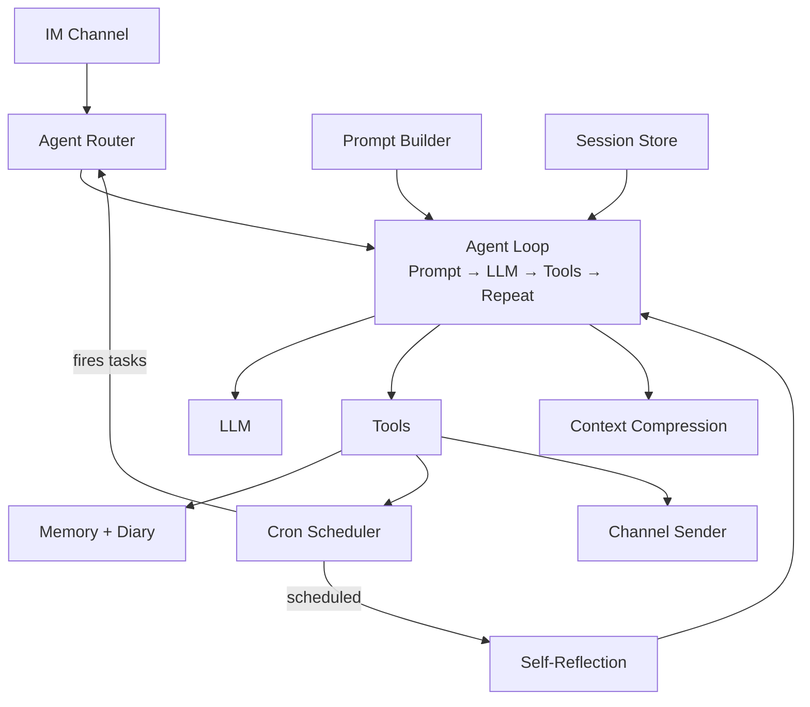

# Cyclaw

AI-powered personal digital assistant built with Go. Connects to OpenAI-compatible LLM APIs and provides an agentic conversational experience over IM with tool-calling capabilities — file I/O, web fetch/search, shell execution, cron scheduling, proactive messaging, long-term memory, daily diary, self-reflection, and a modular skills system.

## Architecture

## Key Design Points

- **Agent Loop** — Repeatedly calls LLM and executes tool calls until a final response or round limit. Supports streaming with real-time messages.
- **Context Compression** — Auto-summarizes older history when token usage exceeds threshold, keeping the most recent portion intact.
- **Long-term Memory** — Persistent memory loaded into every system prompt, updated by the agent across conversations.
- **Daily Diary & Self-Reflection** — Sessions are archived into date-based diary entries. A scheduled self-reflection job reviews recent diary and optionally updates the agent's core identity and memory files.
- **Session Management** — File-backed session persistence with auto-archive on configurable idle timeout. Commands for archiving, clearing, and starting fresh.
- **Cron Scheduler** — Persistent cron scheduling with state tracking. Catches up on missed tasks after restart.
- **Skills System** — Modular skill packages following the agentskills.io spec.
- **Multi-Agent Routing** — Multiple agents routed by chat/group ID with fallback to a default agent.
- **Channel Abstraction** — Decoupled from platform via a sender interface. Supports user allowlisting, verbose tool-call logging, and reply context passthrough.
- **Path Sandbox** — File access scoped to designated directories for agent files, memory, skills, and workspace, with directory traversal protection.
- **Embedded Defaults** — Agent definitions, skills, and memory templates compiled into the binary, extracted on first run without overwriting user modifications.
- **Feature Gating** — Individual tools and the scheduler can be toggled via config. Extra provider-specific tool types can be added for built-in provider tools.
- **Configuration** — YAML-based config with support for per-agent model overrides, reasoning effort tuning, and forced streaming. Supports containerized deployment.
