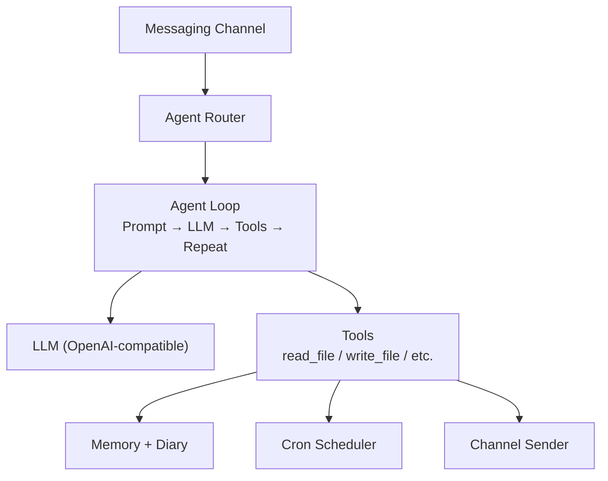

# Cyclaw

AI-powered personal digital assistant built with Go. Connects to OpenAI-compatible LLM APIs and provides an agentic conversational experience over IM with tool-calling capabilities — file I/O, web fetch/search, shell execution, cron scheduling, proactive messaging, long-term memory, daily diary, and a modular skills system.

## Architecture

## Key Design Points

- **Agent Loop** — Repeatedly calls LLM and executes tool calls until a final response or round limit. Supports SSE streaming with real-time Telegram draft messages.
- **Context Compression** — Auto-summarizes older history when token usage exceeds configurable threshold.
- **Long-term Memory** — Persistent memory loaded into every system prompt, updated by the agent across conversations.
- **Daily Diary & Self-Reflection** — Sessions are archived into date-based diary entries. A daily self-reflection cron job reviews recent diary and optionally updates memory and personality.
- **Session Management** — File-backed session persistence with auto-archive on idle timeout. `/new` and `/clear` commands for session control.
- **Cron Scheduler** — Persistent cron scheduling with missed-task catch-up on startup.
- **Skills System** — Modular skill packages loaded from `@skills/` and injected into the system prompt.
- **Multi-Agent Routing** — Multiple agents routed by chat/group ID with fallback to default. Each agent has its own identity, model override, and personality files.
- **Channel Abstraction** — Decoupled from platform via `Sender` interface; currently implements Telegram.
- **@-path Sandbox** — File access scoped to `@agent/`, `@memory/`, `@skills/`, `@workspace/` with traversal protection.
- **Embedded Defaults** — Agent definitions, skills, and memory templates compiled into binary, extracted on first run without overwriting user modifications.
